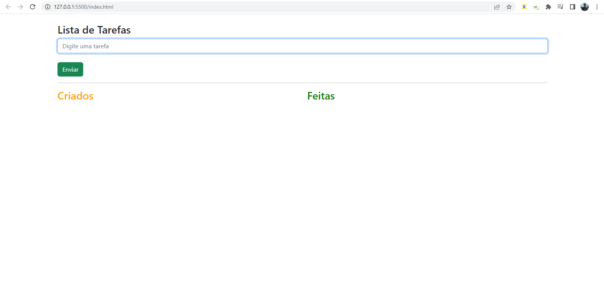
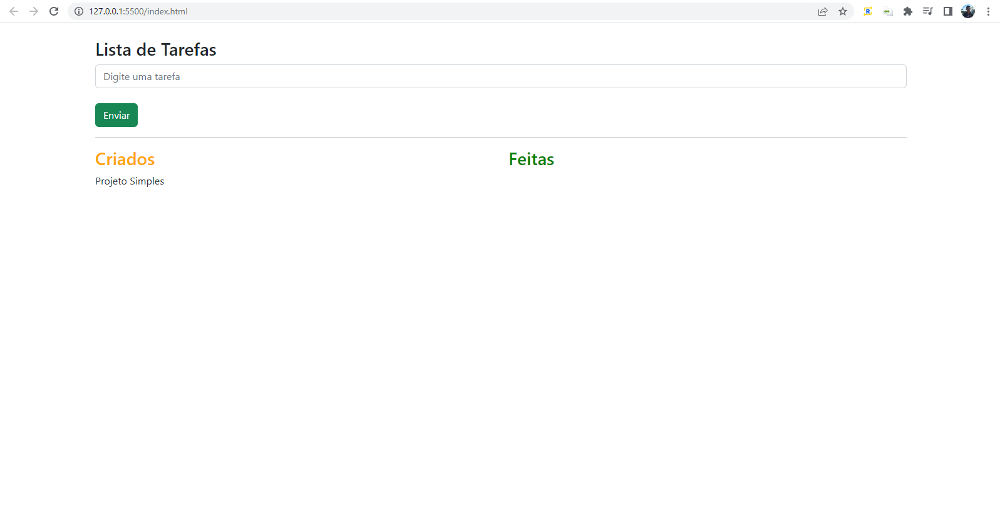

# First-Project-PyScript

Primeiro projeto usando PyScript + HTML + CSS.

Ao ler as notícias sobre o uso do Python no front-end fui atrás de informações para fazer o primeiro teste.
Para exercitar as informações absorvidas fiz um simples TO-DO onde todo o seu funcionamento está vinculado ao PyScript.



Primeiro passo:

* Adicionar o link para ativar a utilização do python. link: https://pyscript.net/alpha/pyscript.js

OBS: 
```
<link rel="stylesheet" href="https://pyscript.net/alpha/pyscript.css" />
<script defer src="https://pyscript.net/alpha/pyscript.js"></script>
```



Adicionando os links para poder usar o pyscript, agora é só aplicar os princípios do python.
Para manipular os elementos DOM, use a função ``` Element() ``` e passe o atributo que redireciona para o elemento, neste caso o ID ou Class.

